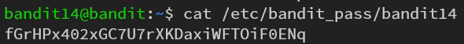

# OverTheWire\[Bandit] Writeup

## :triangular\_flag\_on\_post: Level 0

คือการ ssh เข้าไปยัง server **bandit.labs.overthewire.org** port **2220** โดยใช้ username bandit0 และ password bandit0

```
ssh bandit0@bandit.labs.overthewire.org -p 2220
```

พอเข้ามาแล้วก็จะเป็นแบบนี้

<figure><figcaption></figcaption></figure>

## :triangular\_flag\_on\_post: Level 0-1

เมื่อเข้าไปยังserver แล้ว ให้ใช้ command ls -al เพื่อดูว่ามี file อะไรบ้าง

<figure><figcaption></figcaption></figure>

จะเห็นว่ามีไฟล์ readme ให้เรา cat ออกมาดู ก็จะได้ password ของข้อถัดไปนั่นเอง

<figure><figcaption></figcaption></figure>

ให้เรานำ password ที่ได้ไป login ด้วย user bandit1

<figure><figcaption></figcaption></figure>

เข้าได้แล้ว เย้!!!!!

## :triangular\_flag\_on\_post: Level 1-2

> **Password : NH2SXQwcBdpmTEzi3bvBHMM9H66vVXjL**

เมื่อ ls -al จะเจอไฟล์ - (dashed file)

<figure><figcaption></figcaption></figure>

เนื่องจากเป็น dashed file จึงไม่สามารถใช้คำสั่ง&#x20;

```
cat -
```

ให้เราใช้

```
cat < -
```

<figure><figcaption></figcaption></figure>

ก็จะได้ password ออกมาแล้ว ว้าวว สุดยอดไปเลยย!!!!

## :triangular\_flag\_on\_post: Level 2-3

> **Password : rRGizSaX8Mk1RTb1CNQoXTcYZWU6lgzi**

เมื่อlogin ด้วยuser bandit2 และpassword จากข้อที่แล้ว ให้เรา ls ดูจะพบว่ามีไฟล์ชื่อ space in this filename ให้เรา cat ไฟล์นั้นออกมาดู แต่ๆๆๆๆๆ ถ้าเราใช้คำสั่ง **cat space in this filename** มันจะบึ้มทันที

<figure><figcaption></figcaption></figure>

เพราะมันเข้าใจว่าเราต้องการจะ cat file space ,in ,this ,filename เพราะฉะนั้นอย่าหาตั้งชื่อไฟล์ที่มีการเว้นวรรคใน linux นะจ๊ะ วีธีแก้คือให้ใช้คำสั่ง

```
cat spaces\ in\ this\ filename
```

<figure><figcaption></figcaption></figure>

เห็นมั้ย ได้passwordแล้ววว วู้วววว

## :triangular\_flag\_on\_post: Level 3-4

> **Password : aBZ0W5EmUfAf7kHTQeOwd8bauFJ2lAiG**

โจทย์บอกว่า password อยู่ใน hidden file ใน inhere directory ดังนั้นให้เรา cd เข้าไปยัง inhere แล้ว ls ดูว่ามีไฟล์อะไรบ้าง

<figure><figcaption></figcaption></figure>

จะเห็นว่าไม่มีอะไรเลย เพราะมันซ่อนอยู่ยังไงล่ะ ดังนั้นให้เราใช้ ls -al มันก็จะขึ้นไฟล์ทั้งหมดออกมา แล้วให้เรา cat ออกมา ก็จะได้ password แล้วงับ

<figure><figcaption></figcaption></figure>

## :triangular\_flag\_on\_post: Level 4-5

> Password : 2EW7BBsr6aMMoJ2HjW067dm8EgX26xNe

เมื่อเข้ามาแล้วให้เข้าไปยัง directory inhere หลังจากนั้นให้ ls ดู จะเห็นว่ามีไฟล์เต็มไปหมด

<figure><figcaption></figcaption></figure>

หลังจากนั้นลองดูว่าไฟล์ทั้งหมดคือไฟล์อะไรบ้าง

<figure><figcaption></figcaption></figure>

จะเห็นว่ามีอยู่ไฟล์เดียวที่แตกต่างจากไฟล์อื่น นั่นก็คือ **-file07** ให้เราลอง cat ออกมาดูก็จะได้passwordของข้อถัดไป

<figure><figcaption></figcaption></figure>

## ****:triangular\_flag\_on\_post: Level 5-6

> **Password : lrIWWI6bB37kxfiCQZqUdOIYfr6eEeqR**

ข้อนี้โจทย์บอกว่า password อยู่ในไฟล์ที่มีขนาด 1033 bytes ดังนั้นเราก็ต้องใช้ข้อมูลที่ได้มาให้เป็นประโยช์โดยการค้นหาfileด้วยขนาดfile ด้วยคำสั่ง

```
find . -size 1033c 
```

<figure><figcaption></figcaption></figure>

หลังจากนั้นก็ cat มันออกมา แล้วก็จะได้ password ที่ต้องการ

<figure><figcaption></figcaption></figure>

## :triangular\_flag\_on\_post: Level 6-7

> **Password : P4L4vucdmLnm8I7Vl7jG1ApGSfjYKqJU**

ข้อมูลที่ให้มา คือ owner = bandit7 , group = bandit6 , size = 33bytes ซึ่งเราสามารถ find โดยใช้ข้อมูลเหล่านี้ได้เหมือนกับข้อที่แล้วโดยใช้คำสั่ง

```
find -user bandit7 -group bandit6 -size 33c
```

จะเห็นได้ว่ามีไฟล์ขึ้นมาเยอะแยะเต็มไปหมด

<figure><figcaption></figcaption></figure>

แต่ถ้าสังเกตุดีๆจะเห็นไฟล์ที่ชื่อว่า **bandit7.password** หลังจากนั้นก็ cat ไฟล์ออกมาดูก็จะได้ password

<figure><figcaption></figcaption></figure>

## :triangular\_flag\_on\_post: Level 7-8

> **Password : z7WtoNQU2XfjmMtWA8u5rN4vzqu4v99S**

โจทย์บอกว่าpassword อยู่ในไฟล์ **data.txt** และถัดจากคำว่า millionth ดังนั้นเราก็ cat file data.txt แล้ว filter หาคำว่า **millionth** โดยใช้คำสั่ง

```
cat data.txt | grep millionth
```

<figure><figcaption></figcaption></figure>

## :triangular\_flag\_on\_post: Level 8-9

> **Password : TESKZC0XvTetK0S9xNwm25STk5iWrBvP**

Password อยู่ในไฟล์ **data.txt** ซึ่งเป็นบรรทัดที่ไม่ซ้ำกับบรรทัดอื่นเลย ให้เราใช้คำสั่ง

```
cat data.txt | sort | uniq -u
```

ซึ่งก็คือการcatเนื้อหาข้างในออกมาดูโดยทำการsortก่อน แล้วค่อยแสดงบรรทัดที่ไม่ซ้ำกับบรรทัดอื่นออกมา

สาเหตุที่ต้อง sort ก่อนก็เพราะ **uniq -u** คือการกำจัดบรรทัดที่ซ้ำกันและติดต่อกัน ดังนั้นถ้าหากมีบรรทัดที่ซ้ำกันแต่ไม่ติดกันมันก็จะแสดงออกมาด้วย

เมื่อ cat ออกมาก็จะได้ password สำหหรับข้อถัดไปแล้วจ้าาา

<figure><figcaption></figcaption></figure>

## :triangular\_flag\_on\_post: Level 9-10

> **Password : EN632PlfYiZbn3PhVK3XOGSlNInNE00t**

Password อยู่ไฟล์ data.txt เมื่อเรา cat ออกมาดูจะเจอกับตัวอักษรอะไรไม่รู้ที่อ่านไม่ออกเต็มไปหมด ซึ่งถ้าเราเลื่อนหาดูดีๆก็จะเจอ password เพราะโจทย์บอกว่า password อยู่หลัง เครื่องหมาย = หลายๆตัว แต่ๆๆๆ มีวิธีที่ง่ายกว่านั้นคือใช้คำสั่ง

```
strings data.txt | grep =
```

<figure><figcaption></figcaption></figure>

เมื่อ strings ออกมาดูก็จะเห็นข้อความที่น่าจะเป็น password นั่นก็คือ **G7w8LIi6J3kTb8A7j9LgrywtEU lyyp6s**

## :triangular\_flag\_on\_post: Level 10-11

> **Password : G7w8LIi6J3kTb8A7j9LgrywtEUlyyp6s**

เมื่อ **cat data.txt** จะเจอข้อความที่ encode ด้วย **base64**

<figure><figcaption></figcaption></figure>

ให้เราทำการ decode มันออกมา ด้วยคำสั่ง &#x20;

```
cat data.txt | base64 --decode
```

<figure><figcaption></figcaption></figure>

## :triangular\_flag\_on\_post: Level 11-12

> **Password : 6zPeziLdR2RKNdNYFNb6nVCKzphlXHBM**

เมื่อเรา cat file data.txt จะเจอ strings ที่ encode ด้วยrot13&#x20;

<figure><figcaption></figcaption></figure>

ซึ่งก็คือการshiftตัวอักษรไป13ครั้ง ดั้งนั้นเราก็ต้องเลื่อนกลับมา13ครั้งเพื่อให้ได้passwordที่เราต้องการ

```
cat data.txt | tr '[a-z][A-Z]' '[n-za-m][N-ZA-M]'
```

<figure><figcaption></figcaption></figure>


## :triangular\_flag\_on\_post: Level 12-13

> **Password : JVNBBFSmZwKKOP0XbFXOoW8chDz5yVRv**

ในข้อนี้  data.txt ที่เขาให้มาเป็นเป็นไฟล์ hexdump ซึ่งเราจะต้อง reverse มันออกมา&#x20;

```
xxd -r data.txt > data1
```

เมื่อใช้คำสั่ง file เพื่อดูว่า data1 คือไฟล์อะไร จะเห็นได้ว่ามันคือไฟล์ .gzip

<figure><figcaption></figcaption></figure>

ให้เราทำการแปลง data1 -> data1.gz

```
mv data1 data1.gz
```

หลังจากนั้นแตกไฟล์มันออกมา

```
gunzip data1.gz
```

จะได้ data1 ที่เป็นไฟล์ .bzip

<figure><figcaption></figcaption></figure>

ให้แตกไฟล์ bzip ออกมา จะได้ไฟล์ที่เป็น gzip

```
bzip2 -d data1
```

ให้เราแปลงไฟล์ที่ได้มาจากการแตก bzip ให้เป็น .gz หลังจากนั้นให้แตกไฟล์ออกมา จะได้เป็นไฟล์ .tar

<figure><figcaption></figcaption></figure>

ให้เราแตกไฟล์ .tar ด้วยคำสั่งด้านล่างนี้ จะได้ไฟล์ที่ชื่อว่า data5.bin

```
tar -xvf data3
```

เมื่อใช้คำสั่ง file ดู file data5.bin พบว่าเป็นไฟล์ tar เหมือนกัน ดังนั้นก็ใช้คำสั่งเดิมในการแตกไฟล์มันออกมา ก็จะได้ไฟล์ data6.bin หลังจากนั้นใช้คำสั่ง file เพื่อดูว่าfile data6.bin คือ file อะไร ซึ่งคำตอบก็ไฟล์ bzip นั่นเอง&#x20;

<figure><figcaption></figcaption></figure>

เมื่อแตกไฟล์ data6 ออกมา ก็จะได้ ไฟล์ data6 ที่เป็น .tar ให้แตกไฟล์ data6.tar ก็จะได้ data8.bin ซึ่งจริงๆมันคือfile gzip&#x20;

<figure><figcaption></figcaption></figure>

เราก็ต้องแปลงจาก .bin -> .gz

```
 mv data8.bin data8.gz
```

แล้วก็แตกไฟล์มันออกมา จะได้เป็นไฟล์ data8 ที่เป็น ASCII Text

<figure><figcaption></figcaption></figure>

ขั้นตอนสุดท้ายคือการ cat file data8 เราก็จะได้ password ที่เราต้องการแล้ว เย้ยยยยยย:tada:

<figure><figcaption></figcaption></figure>

## :triangular\_flag\_on\_post: Level 13-14

> **Password : wbWdlBxEir4CaE8LaPhauuOo6pwRmrDw**

ในข้อนี้เราจะไม่ได้ password แต่เราจะต้อง get private SSH key ออกมา เพื่อนำไปเข้า user bandit14

ซึ่งเมื่อเรา SSH เข้ามาด้วย bandit13 เราจะเจอไฟล์ sshkey.private

<figure><figcaption></figcaption></figure>

ให้เรา get มันออกมากด้วยการออกไปยังเครื่องเราก่อน แล้วใช้คำสั่ง

```
scp -P 2220 bandit13@bandit.labs.overthewire.org:sshkey.private .
```

หลังจากนั้นให้เราทำการ login ด้วย bandit14 แล้วใช้ key เมื่อกี้แทน password&#x20;

```
ssh -i sshkey.private bandit14@bandit.labs.overthewire.org -p 2220
```

จะเห็นว่ามันเข้าไม่ได้ เพราะ permission ของ key ตัวนี้มัน open เกินไป&#x20;

<figure><figcaption></figcaption></figure>

ให้เราแก้ไข permission โดยในที่นี้จะใช้เป็น 600 ด้วยคำสั่ง&#x20;

```
chmod 600 sshkey.private
```

หลังจากนั้นก็ให้ลองเข้าใหม่ จะเห็นว่าเข้าได้แล้วววววว

<figure><figcaption></figcaption></figure>

ซึ่งโจทย์บอกว่า password อยู่ใน **/etc/bandit\_pass/bandit14** ดังนั้นให้เรา cat ออกมา ก็จะได้ password แล้ว

<figure><figcaption></figcaption></figure>

## :triangular\_flag\_on\_post: Level 14-15

> Password : fGrHPx402xGC7U7rXKDaxiWFTOiF0ENq

ในข้อนี้โจทย์บอกว่า password สำหรับข้อถัดไปอยู่ที่ port 30000 บน localhost

```
nc localhost 30000
```

เมื่อเข้าไปแล้วก็จะเจอ password สำหรับข้อถัดไปเลย

<figure><figcaption></figcaption></figure>

## :triangular\_flag\_on\_post: Level 15-16

> Password : jN2kgmIXJ6fShzhT2avhotn4Zcka6tnt

password อยู่ใน localhost:30001 ให้เราเข้าผ่าน SSL&#x20;

```
openssl s_client -connect localhost:30001 -quiet
```

เมื่อเข้าแล้วก็จะเจอ password เลย

<figure><figcaption></figcaption></figure>


